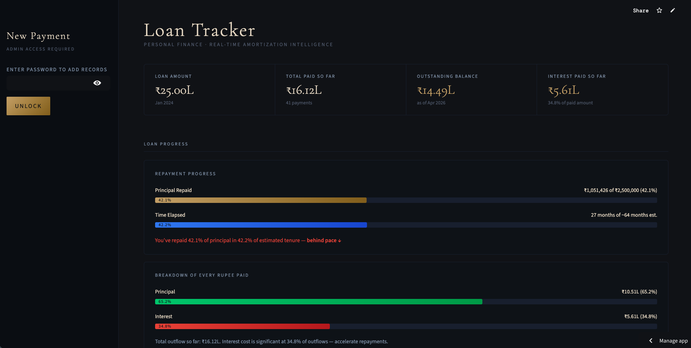
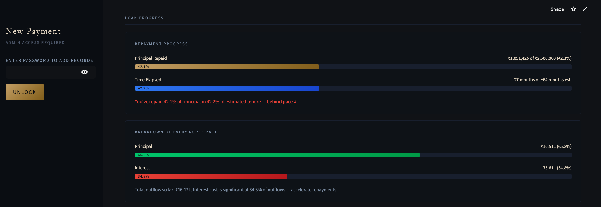
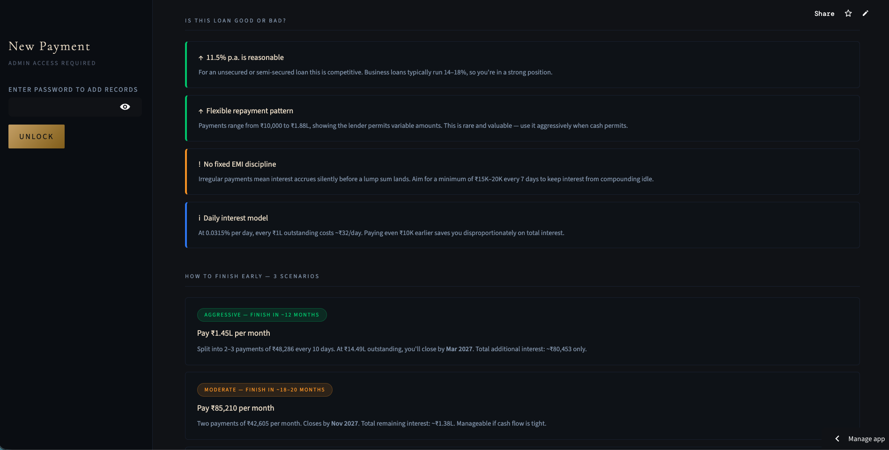
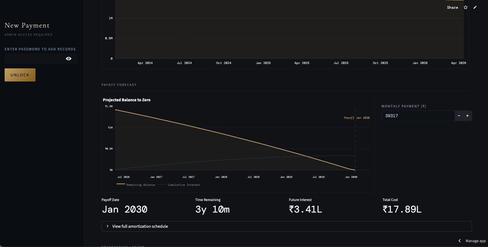

# 💰 Loan Tracker

[](https://apploanproject-yzdbzw6gid9bwul2upareu.streamlit.app/)
[](https://python.org)
[](https://azure.microsoft.com)
[](https://streamlit.io)

> A personal loan intelligence dashboard — real-time amortization, payoff forecasting, and financial insights. Built after giving my loan details to Claude and being stunned by what I didn't know about my own money.

---

## 🖥️ Live Demo

**[→ Open the live app](https://apploanproject-yzdbzw6gid9bwul2upareu.streamlit.app/)**


---

## 📸 Screenshots

> **Add your screenshots here after uploading them to the repo.**
> Tip: drag and drop images directly into a GitHub issue, copy the URL, paste it below.

```




```

---

## ✨ Features

### 📊 Real-time Dashboard
- 4-column KPI strip — loan amount, total paid, outstanding balance, interest paid
- Principal vs interest breakdown with progress bars
- Pace indicator — ahead or behind on repayment vs estimated tenure

### 🧠 Financial Intelligence
- **Is this loan good or bad?** — 4 insight cards with verdicts (rate assessment, payment flexibility, EMI discipline, daily cost model)
- Daily cost calculation — exact rupee cost per ₹1L outstanding per day
- Payment pattern analysis from your own history

### 📈 3 Payoff Scenarios
- Aggressive / Moderate / Conservative — with exact payoff dates
- Total future interest per scenario
- Visual comparison of interest cost across paths

### 🔮 Interactive Forecast
- Adjustable monthly payment slider
- Dual-line Plotly chart — falling balance + rising cumulative interest
- Full amortization schedule (month-by-month)

### 💳 Payment Recording
- Sidebar form — amount + date
- Auto interest calculation (daily reducing balance)
- Instant dashboard refresh on submission
- Full transaction ledger

---

## 🏗️ Architecture

```
┌─────────────┐     HTTPS      ┌──────────────────────────────────────┐
│   Browser   │ ─────────────► │          Streamlit Cloud             │
│ (any device)│                │  ┌────────────────────────────────┐  │
└─────────────┘                │  │        Python App              │  │
                               │  │  ┌──────────┐  ┌───────────┐   │  │
                               │  │  │Streamlit │  │  Business │   │  │
                               │  │  │    UI    │  │   Logic   │   │  │
                               │  │  └──────────┘  └─────┬─────┘   │  │
                               │  │  ┌──────────┐        │pyodbc   │  │
                               │  │  │  Plotly  │        │         │  │
                               │  │  │  Charts  │        │         │  │
                               │  │  └──────────┘        │         │  │
                               │  └────────────────────────────────┘  │
                               └──────────────────────┬───────────────┘
                                                      │
                                                      ▼
                               ┌──────────────────────────────────────┐
                               │            Azure SQL                 │
                               │   LoanSummary  │  Payments           │
                               └──────────────────────────────────────┘
```

---

## 🗄️ Database Schema

### `LoanSummary` (1 row — current state)
| Column | Type | Description |
|--------|------|-------------|
| `current_balance` | DECIMAL | Outstanding principal |
| `total_paid` | DECIMAL | All payments ever made |
| `total_interest` | DECIMAL | Interest portion of total paid |
| `last_payment_date` | DATE | Used for interest calculation |

### `Payments` (1 row per payment)
| Column | Type | Description |
|--------|------|-------------|
| `payment_date` | DATE | Date of payment |
| `amount` | DECIMAL | Total amount paid |
| `interest_paid` | DECIMAL | Interest portion |
| `principal_paid` | DECIMAL | Principal portion |
| `balance_after` | DECIMAL | Remaining balance after payment |

### Interest Formula
```python
interest = balance × (annual_rate / 365) × days_since_last_payment
principal_paid = payment_amount - interest
new_balance = balance - principal_paid
```

---

## 🛠️ Tech Stack

| Layer | Technology |
|-------|-----------|
| Frontend / UI | Streamlit |
| Charts | Plotly |
| Backend logic | Python 3.11 |
| Database | Azure SQL (free serverless tier) |
| DB connector | pyodbc |
| Hosting | Streamlit Cloud (free tier) |
| Data processing | Pandas |

---

## 🚀 Run Locally

### Prerequisites
- Python 3.9+
- [ODBC Driver 17 for SQL Server](https://learn.microsoft.com/en-us/sql/connect/odbc/download-odbc-driver-for-sql-server)
- An Azure SQL database (or any SQL Server instance)

### 1. Clone the repo
```bash
git clone https://github.com/Zainal606/Streamlit_loan_project
cd loan-tracker
```

### 2. Install dependencies
```bash
pip install -r requirements.txt
```

### 3. Set up the database

Run these SQL statements in your Azure SQL database:

```sql
CREATE TABLE LoanSummary (
    id INT PRIMARY KEY DEFAULT 1,
    current_balance DECIMAL(18,2),
    total_paid DECIMAL(18,2),
    total_interest DECIMAL(18,2),
    last_payment_date DATE
);

CREATE TABLE Payments (
    id INT IDENTITY(1,1) PRIMARY KEY,
    payment_date DATE,
    amount DECIMAL(18,2),
    interest_paid DECIMAL(18,2),
    principal_paid DECIMAL(18,2),
    balance_after DECIMAL(18,2)
);

-- Seed with your loan details
INSERT INTO LoanSummary VALUES (1, 1455000, 0, 0, '2024-01-22');
```

### 4. Configure secrets

Create `.streamlit/secrets.toml`:
```toml
[database]
server = "your-server.database.windows.net"
database = "your-database-name"
username = "your-username"
password = "your-password"
```

> ⚠️ Never commit this file. It's in `.gitignore`.

### 5. Run
```bash
streamlit run app.py
```

---

## ☁️ Deploy to Streamlit Cloud

1. Push code to GitHub (without secrets)
2. Go to [share.streamlit.io](https://share.streamlit.io)
3. Connect your repo → select `app.py` as entry point
4. Add secrets in the Streamlit Cloud dashboard (Settings → Secrets)
5. Add `packages.txt` to repo root:
```
unixodbc-dev
```
6. Deploy ✅

---

## 📁 Project Structure

```
loan-tracker/
├── app.py                  # Main Streamlit application
├── requirements.txt        # Python dependencies
├── packages.txt            # System packages (for Streamlit Cloud)
├── .gitignore              # Excludes secrets and cache
├── README.md               # This file
└── screenshots/            # Dashboard screenshots (add your own)
```

---

## 🧭 What I Learned

This project started when I gave my loan details to Claude and was surprised by how little I understood about my own finances. Building it taught me:

- **Streamlit** is underrated for internal and personal tools
- **Daily reducing balance** calculations and why payment timing matters
- **Azure SQL free tier** — when it's enough and when it isn't
- **Deploying Python apps** to cloud — the real-world gaps between localhost and production
- The difference between a dashboard that shows data and one that gives **insight**

---

## 🔮 Roadmap

- [ ] Multi-loan support with switcher
- [ ] Email reminders when balance crosses milestones
- [ ] PDF statement export
- [ ] Proper authentication layer
- [ ] OCI / Oracle Cloud migration (learning project)

---

## 👤 About

Built by **Zainal** —  MTech Cloud Computing.

Working toward a Cloud Ops / Cloud DBA role. This project is part of that journey.

[](https://www.linkedin.com/in/zainal-abdeen-hameed/)
[](https://github.com/Zainal606/)

---

## 📄 License

MIT — use it, fork it, build your own version.
